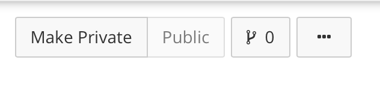

# Working transparently on OSF

In Chapter 1, I described how we are working together on something bigger than any single project. My role is both to facilitate your project while you are completing it and to carry it forward when possible after you are finished with it. To do both of those I things, I need to be able to see your work. I need to know what you have finished (and by extension, what you are currently working on) and I need to be able to find your finished products and comprehend them even if I look them up years after you finished them. That means that you need to curate your work in some place that I can always access. By *curate*, I mean create support that guides me through your work so that I, or any one else, can figure out exactly what you did. 

It is a chore to curate the materials and data from a project after it is already finished. You forget quite a lot even in the months between starting and finishing a short project. However, while you are working on the project you are actually doing the work I mean when I say *curating*: you frequently need to explain to me or other colleagues how your experiment works or what you did to the data. So, what I insist on is that you do this in a permanent way by putting this information on ***OSF*** (that's for Open Science Framework), rather than in a private way like jotting it down on your private notebook.

## The OSF environment

OSF is a web-based repository that scientists use to organize their research. OSF is free to use. Sign up for an account on OSF by visiting [osf.io](osf.io) and clicking the green **Sign Up** button at the top of the page.

Depending on what you are working on, you may need to create a new project or you may be added as a Contributor to an existing project. 

### Creating a new project

Most projects we do will share a common structure: they will include directories for preliminary planning, experimenter paperwork, run files, data and analysis scripts, and communications. If your new project will contain most of these, then you can start by searching OSF for the "OSF Research Project Template" designed by Candice Morey. You can look at the descriptions of the components, and if you like, duplicate this template and use it for your new project. To duplicate it, click the button on the upper right side of the screen that looks like a little branch. A menu will appear below.

```{r, echo=F}

```

If you choose "Duplicate this template", then OSF will create a new project with the same directory structure. You can then fill in the details, delete directories you may not need, or change the names of directories. If you choose "Fork this Project", OSF will create a new project copying everything about the forked page, including the Wiki content and the project description. All of that can be edited in your new project.

Remember that your project, though new to you, may be embedded with some related ongoing project. If so, it might make more sense for you to be added to that existing project as a contributor. Identifying which circumstance you are in will be one of the first things you and the PI sort out.

### Becoming a contributor

One of the lab members may add you as a contributor to an existing OSF page. This will enable you to at least read, and probably read and edit, the existing page. Our projects usually have the same directory structure, but the number of sub-directories in each section may vary depending on how many studies fall under one project heading. If you are added to an existing project, first familiarize yourself with what is there and how it is organized. Then, discuss with one of the other contributors how you should add to the page. Most likely, there will sub-directories in each folder corresponding to each related project, and you will be asked to create sub-directories for your project.

### Naming conventions

For the files you see on OSF, there should be some commonalities in how they are named. You will need to come up with a scheme for naming the files associated with your project. This should not be something too generic like "dissertation consent form.doc" or "experiment 1": if that were allowed we would have dozens of files with the same names. Pick a short name or acronym for your project that says something about what is unique about it. Then, use that short name to name your files. So, instead of "consent form.pdf" your file might be "wmSpanPrefix_consentForm.pdf". Note also the use of the underscore: it is good practice never to include spaces in file names. Note also the initial word is lowercase and subsequent words are capitalized. This formatting is called *camelCase*. We frequently have to type file names in contexts where the name must be reproduced exactly for code to run, so it is very helpful if you consistently apply camelCase to all your final names. 

### Contributors

You can see who all the *contributors* on a project are by clicking the ***Contributors*** button on the upper ribbon. You may be able to add new contributors if you would like for someone else to be able to see your page. You can choose whether to let a new contributor only read your page or also edit your project page.

At minimum, you and your PI should both be contributors to your project. The PI should always have at least Read + Write access, and possibly Adminstrator access.

A *bibliographic* contributor is someone who will share in authorship on any presentations or papers that result from the project. If you want to share your page with an outside colleague (maybe as part of a job application, or maybe with a peer who is reviewing your work for you) you can add them as a non-bibliographic contributor. If this person only needs to have a look at your project, then alternatively you can provide them with a view-only link without adding them to the project as a contributor.

### Public versus private

Usually, your project will start out as private, and eventually may become public. Our standard is to set a project to "Public" once we have communicated the data outside the lab by presenting it at a conference or submitting a manuscript. 

There may occasionally be good reason never to make a project public, for instance if we cannot ensure that our participants' identities are anonymous. However, normally we can easily do this.

### Wikis

OSF allows you to describe each project directory and sub-directory with a Wiki. Take a look at the Wikis on the OSF Research Project Template for an example of what you might typically want to know about the contents of a directory. 

## Using your OSF project page to monitor progress

We will both be able to clearly see how your work is progressing from the updates on your OSF page. The pace of progress will vary but the order of events will be pretty consistent. I'll briefly describe the usual project components in the usual order. Each of these steps has its own chapter with more detail later.

### First you generate a plan

When we first start discussing the project, we will converge on an experimental design and will work out the possible outcomes we might observe given that design. This may take a while, through a process of reading and discussion. Eventually, you should aim to note down your plans and predictions in a document, and post this document in your Preliminary Plans sub-directory. 

Your Preliminary Plans directory may also include work you did that informed your plan. For example, see the Preliminary Plans directory in *A complex effect of memory load on processing speed*.

### Then you prepare your materials

You will need to get, modify, or create software to display stimuli and collect responses, craft a consent form and debriefing statement for your participants, work up an experimental protocol, and test that these materials work to all the contributors' satisfaction.

Once we are happy with the materials (i.e., they have been pilot-tested, the output has been checked, etc.) they go in their appropriate sub-directories.

### Then you work on data analysis

Once you have stopped acquiring data, you should compile it into one file (or we may do this together in a *Data Round-up Meeting*), anonymize it (more on that later), and upload it to the Data and Analysis Scripts directory. You can add analyses when you have finished them.

### Finally, you communicate your research

When your written report or presentation is complete, you upload it to your Papers and Presentations directory.

At any time during your project, I will be able to see what is on OSF, and with that know what you are finished with, what you should be currently working on. Knowing this will help me give you useful feedback at the appropriate time and be better prepared to help with whatever you might be grappling with.

## Registering milestones

OSF provides free storage for your materials and data. You can think of it as a back-up system that encompasses not just your data, but also your thoughts about your project. That turns out to be really important because we need to keep track of what we believed before seeing the data versus what we believed based on the data. 

Making a *registration* creates a frozen, time-stamped version of your project. Registrations cannot be changed, while projects can. Someone could remove data from a project, but not from a registration. It makes sense to register your project at key moments where you might want a permanent record of what you thought before the next phase. Generally, we want to register a project:

1. When we have recorded the definitive study design and predictions
2. After the anonymized data are uploaded
3. When the analyses are finished
4. When the manuscript is submitted (repeat as necessary)
5. When the manuscript is published

These registrations back-up your work, but also allow you to prove when your hypotheses preceded the data.

## When copying is okay

You may be added to an ongoing project, and assume responsibility for some new component of that project. The project might already include materials you could use. But is it a problem to just use them, rather than create your own from scratch?

There are some research materials that it is always okay to copy, or modify slightly for a new purpose. You should always make your consent form from the lab's template. Doing this ensures that important legalese that should be in the form is always there. You do not need to come up with new, original ways to program the same experiment or script the same analysis; it is always fine to copy an existing sample and modify it slightly to meet your needs. You should acknowledge the original creator when doing this, if the original creator is not already a bibliographic contributor on your project (if s/he is, then s/he will already get acknowledged in your work). 

You should not absolutely copy text destined for your manuscript if you are producing a dissertation or thesis based on the work. Dissertations and theses differ from group-written manuscripts in that a student is composing them to show what s/he has learned about the work and about writing an empirical report in general. If your project is a dissertation or thesis, you must write your work originally, not quote or refer heavily to the method or result from a related lab project. You may look at any example documents we have to see what the other authors included, but then close the example and write your own.

If you are working on a project that follows on from another one and is not being submitted for a university degree, then you probably could copy text from related Method sections and modify it as needed. In a serial report of several experiments, the Method and Results of experiments that follow from previous ones are often streamlined by referring back to the first. This is fine for a manuscript intended for publication; in fact, you want to aim for brevity when possible.


