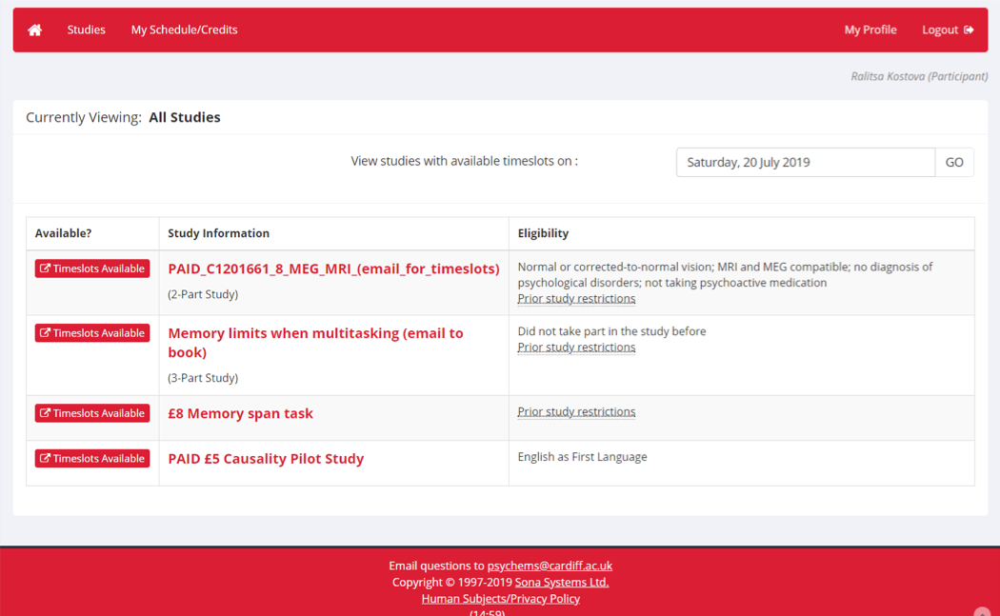

# Recruiting participants

## Adults from the university community

### Experiment Management System (EMS)

The most convenient way to recruit adults capable of consenting on their own behalf for your research project is to use Cardiff University's Experiment Management System (EMS). EMS has been purchased by the School of Psychology (it is actually more widely known as SONA systems) to manage and monitor study sign-up procedures in conjunction with the participant panel scheme. Year 1 and Year 2 students on psychology degrees are required to participate in research as part of their education, and researchers in the School are responsible for making opportunities for this participation available. Participants can sign up for studies online, researchers can set up their studies online, and administrators can ensure participants have completed all their requirements. This is all done from any web browser, and is available 24 hours a day.  

EMS is convenient for researchers for several reasons. Researchers can easily signal when they would like to run sessions by offering a schedule of appointments to the available participants. Participants then claim the session they prefer. Settings within EMS allow researchers to exclude participants based on stated criteria or based on studies they have completed in the past, minimizing time spent working with ineligible participants and making it unnecessary to keep logs of previous participants identities. Researchers may also offer study opportunities for "credit" (meaning that students can earn the course credits they need for taking part) or alternatively for pay. The same study can be offered for either credit or payment.

### Access to EMS

The first thing to do is to obtain a researcher account from the EMS team. This can be done by emailing psychems@cardiff.ac.uk. Just let them know that you are a researcher, working with Dr Candice Morey, and you need an account to post an experiment and shortly they will send you an email with your credentials.

If you are completing your undergraduate BPS project, there is a ethics training process that you must complete before accessing EMS. Instead of emailing to request an account, your EMS account will be granted upon completion of this mandatory training.

### Administering an experiment on EMS

This is quite straightforward: when you create a new study, you will be prompted to fill in fields for all the information needed to advertize a study. Please refer to the detailed EMS user guide linked on the EMS log in page (note - this is an internal document accessible only to Cardiff staff and students). There are strict rules for naming your study so as not to bias students in favor or against choosing your study. Available studies are listed to students in a random order. Note that participants can only see the calendar with available studies on the selected day (Fig. 1). Participants see whichever studies have availability on the day they select, not all studies.


```{r, echo = FALSE}


```


This means that if you do not open any timeslots, registered participants won’t be able to see your study at all. The system is designed to minimize back-and-forth between participants and researchers scheduling them. You say when you want to work, and participants either take the appointment or leave it. This works smoothly when there is a large population of participants available. If for some reason you need to personally arrange appointments (e.g., if you are running a multi-session study and need to negotiate session times per participant within certain time frames) you can still use the system to recruit. In this case, you would need to create two studies on the system and condition participating in the second study on having completed the first. 

Once you assign timeslots you can also change them, delete them, etc. Just as researchers expect courtesy from participants regarding cancelling and rescheduling, researchers must extend similar courtesy to participants. If you are offering appointments for credit, researchers and participants may cancel for any reason if they cancel 24 hours or more from the appointment time. If you must cancel a session inside 24 hours, then you must grant the participants credit. If a participant fails to show up for a credit appointment, the researcher has some discretion over what to do about it. The researcher is entitled to issue a penalty for this, and should do that unless the participant has contacted the researcher with a satisfactory reason for missing the appointment or cancelling on short notice. Assigning credits and penalties is done through EMS. Once the appointment timeslot is in the past, a dialogue for that appointment becomes available, allowing the researcher to choose whether 1) credit should be assigned, 2) the appointment was a no-show (excused), or 3) the appointment was a no-show (unexcused). Choose whichever option matches the circumstance.

With paid participants, you similarly need to cancel 24 hours ahead of time, otherwise the participant is entitled to payment.

EMS will remind participants by email of their appointments. You can set your experiment to alert you (or not) when there are sign-ups and cancellations, or when you have filled appointments coming up. 

### Alternatives to EMS

Sufficient numbers of credit and paid participants are available via EMS during both academic terms. During holidays and exam periods, virtually no credit participants are available and the population of paid participants diminishes. If you need credit participants, you must plan to recruit during term time. 

Even when paying participants, EMS may not yield sufficient numbers during the summer months. Alternative methods of recruitment during the summer to complement EMS include advertising paid research opportunities on social media and flyering in locations where eligible participants are likely to notice (around campus, in cafes, etc.). Calls for participants may be posted on the *Take part in research* Yammer channel. 

### Paying participants

Paying participants is essential for collecting data outside of term time, but of course it is only an option if you have a source of funding for it. Payments for participants are administered by the researcher, with funds released to the researcher by School of Psychology Finance when an appropriate budget is available to draw upon.

Do you have access to a participant payment budget and want to proceed? You must request the funds you need from Psychology Finance (psychfinance@cardiff.ac.uk) several days before you need the money. It can take up to 2 weeks to set up, so plan this well in advance. Psychology Finance need to know the total amount you need, what university account to draw it from. There is a template spreadsheet researchers must use to keep track of who has participated and how much they should be paid. Researchers must give participants who completed the study the link to Finance's Qualtrics survey, which is used to collect participants' bank information. Once per week, the contents of this online survey are married up to the ongoing spreadsheet submitted by the researcher, and participants listed in both are issued the payments.

## Children from the local community

Sometimes we recruit children to take part in our research. We have recruited children by arranging to test in schools and by inviting families to bring their children to the university for testing. 

Regardless of how you are recruiting children, you will first need to acquire a basic DBS (disclosure and barring service) check. This is an authorized confirmation that you do not have a criminal record that prohibits working with children or other vulnerable populations.

### How to recruit via schools

It is necessary to first make contact with the head teacher (or sometimes a designated community liaison) of a school and explain 1) what your study entails for the participants, and 2) what we anticipate learning from it. The head teacher can authorize us to send consent forms for parents home with children, and make a quiet place in the school available for testing. In the first instance, contact head teachers via email to the school's general account or via hand-written note, sent in the mail. Start this process as far ahead of testing as you can; it can take a while for interested schools to make contact with you.  

Head teachers are extremely busy - we cannot expect that assisting us with research is their top priority. We must make ourselves available on their timetable and respect the limits (in terms of time in the school, etc.) they are comfortable making available to us. Note that our ethics approval *requires* explicit, opt-in consent from parents, so the first step is always to send forms home explaining what we are doing and why we think it will be beneficial. We can only test children for whom we receive completed, signed parental consent forms.

We have only begun working in schools, so cannot yet describe in detail our means of feeding results back to them. We have offered to put on workshops, targeted either toward staff or students, to teach principles of memory. 

There is a record of contacts attempted with local schools maintained by CUCHDS. If you are attempting to establish a relationship with a school, you should first consult this record to learn whether contact has been attempted before and whether the school is open to working with researchers in general.

### How to recruit via the CUCHDS database

Often, it is necessary to test children in a controlled setting. We use the CUCHDS facilities for this. CUCHDS features several child-friendly testing spaces, including some equipped with EEG, fNIRS, and eye-tracking capabilites, bookable by personnel with access. (The PI can request access on your behalf - this is done via psych-facilities.)

CUCHDS maintains a database of families who have indicated that they would like to take part in research projects (see TinyToTots). Access to this database is controlled by Dr. Ross Vanderwert. 

When contacting participants, it is important to greet them personally. Do not send a bulk email to everyone in the database that meets your inclusion criteria. Send a personal message, offering a chance to participate. If the family has indicated a preferred means of contact other than email, use the preferred means instead. Include details about what the child would be doing, how long it will take, who is eligible, and general information about what we are studying.

### Recruiting via social media

Another way to recruit families is via social media. TinyToTots maintains a Facebook page, and can post a call for participants for a particular study opportunity. To make the most of this, you should create an image including the relevant details that can be posted to Facebook. Details should include what the participant will be doing, who is eligible, how long it will take, until when you are recruiting, and contact information. The flier should include a fun, colorful image to attract attention. The Facebook account is managed by Dr. Ross Vanderwert.

The *Participate in research* Yammer channel may also yield some recruits. It is monitored by a lot of university staff, who actively participate themselves and might be open to bringing their family in for research opporuntities.


