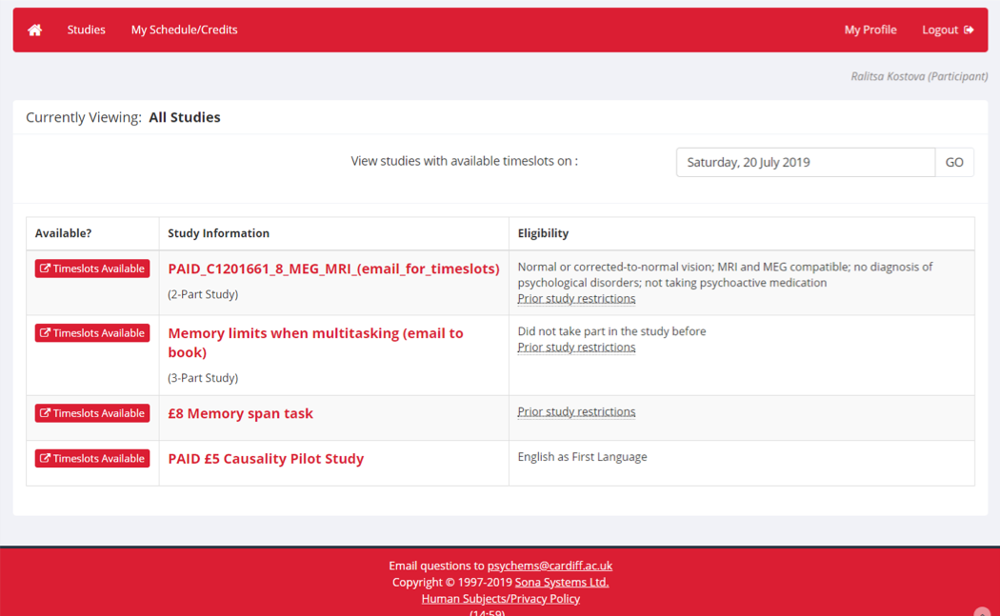

# Recruiting participants

## Adults from the university community

### Experiment Management System (EMS)

The most convenient way to recruit adults capable of consenting on their own behalf for your research project is to use Cardiff University's Experiment Management System (EMS). EMS has been purchased by the School of Psychology (it is actually more widely known as SONA systems) to manage and monitor study sign-up procedures in conjunction with the participant panel scheme. Year 1 and Year 2 students on psychology degrees are required to participate in research as part of their education, and researchers in the School are responsible for making opportunities for this participation available. Participants can sign up for studies online, researchers can set up their studies online, and administrators can ensure participants have completed all their requirements. This is all done from any web browser, and is available 24 hours a day.  

EMS is convenient for researchers for several reasons. Researchers can easily signal when they would like to run sessions by offering a schedule of appointments to the available participants. Participants then claim the session they prefer. Settings within EMS allow researchers to exclude participants based on stated criteria or based on studies they have completed in the past, minimizing time spent working with ineligible participants and making it unnecessary to keep logs of previous participants identities. Researchers may also offer study opportunities for "credit" (meaning that students can earn the course credits they need for taking part) or alternatively for pay. The same study can be offered for either credit or payment.

### Access to EMS

The first thing to do is to obtain a researcher account from the EMS team. This can be done by emailing psychems@cardiff.ac.uk. Just let them know that you are a researcher, working with Dr Candice Morey, and you need an account to post an experiment and shortly they will send you an email with your credentials.

If you are completing your undergraduate BPS project, there is a ethics training process that you must complete before accessing EMS. Instead of emailing to request an account, your EMS account will be granted upon completion of this mandatory training.

### Administering an experiment on EMS

This is quite straightforward: when you create a new study, you will be prompted to fill in fields for all the information needed to advertize a study. Please refer to the detailed EMS user guide linked on the EMS log in page (note - this is an internal document accessible only to Cardiff staff and students). There are strict rules for naming your study so as not to bias students in favor or against choosing your study. Available studies are listed to students in a random order. Note that participants can only see the calendar with available studies on the selected day (Fig. 1). Participants see whichever studies have availability on the day they select, not all studies.


```{r, echo = FALSE}


```


This means that if you do not open any timeslots, registered participants won’t be able to see your study at all. The system is designed to minimize back-and-forth between participants and researchers scheduling them. You say when you want to work, and participants either take the appointment or leave it. This works smoothly when there is a large population of participants available. If for some reason you need to personally arrange appointments (e.g., if you are running a multi-session study and need to negotiate session times per participant within certain time frames) you can still use the system to recruit. In this case, you would need to create two studies on the system and condition participating in the second study on having completed the first. 

Once you assign timeslots you can also change them, delete them, etc. Just as researchers expect courtesy from participants regarding cancelling and rescheduling, researchers must extend similar courtesy to participants. If you are offering appointments for credit, researchers and participants may cancel for any reason if they cancel 24 hours or more from the appointment time. If you must cancel a session inside 24 hours, then you must grant the participants credit. If a participant fails to show up for a credit appointment, the researcher has some discretion over what to do about it. The researcher is entitled to issue a penalty for this, and should do that unless the participant has contacted the researcher with a satisfactory reason for missing the appointment or cancelling on short notice. Assigning credits and penalties is done through EMS. Once the appointment timeslot is in the past, a dialogue for that appointment becomes available, allowing the researcher to choose whether 1) credit should be assigned, 2) the appointment was a no-show (excused), or 3) the appointment was a no-show (unexcused). Choose whichever option matches the circumstance.

With paid participants, you similarly need to cancel 24 hours ahead of time, otherwise the participant is entitled to payment.

EMS will remind participants by email of their appointments. You can set your experiment to alert you (or not) when there are sign-ups and cancellations, or when you have filled appointments coming up. 

### Alternatives to EMS

Sufficient numbers of credit and paid participants are available via EMS during both academic terms. During holidays and exam periods, virtually no credit participants are available and the population of paid participants diminishes. If you need credit participants, you must plan to recruit during term time. 

Even when paying participants, EMS may not yield sufficient numbers during the summer months. Alternative methods of recruitment during the summer to complement EMS include advertising paid research opportunities on social media and flyering in locations where eligible participants are likely to notice (around campus, in cafes, etc.). Calls for participants may be posted on the *Take part in research* Yammer channel. 

### Paying participants

Paying participants is essential for collecting data outside of term time, but of course it is only an option if you have a source of funding for it. Payments for participants are administered by the researcher, with funds released to the researcher by School of Psychology Finance when an appropriate budget is available to draw upon.

Do you have access to a participant payment budget and want to proceed? You must request the funds you need from Psychology Finance (psychfinance@cardiff.ac.uk) several days before you need the money. It can take up to 2 weeks to set up, so plan this well in advance. Psychology Finance need to know the total amount you need, what university account to draw it from. There is a template spreadsheet researchers must use to keep track of who has participated and how much they should be paid. Researchers must give participants who completed the study the link to Finance's Qualtrics survey, which is used to collect participants' bank information. Once per week, the contents of this online survey are married up to the ongoing spreadsheet submitted by the researcher, and participants listed in both are issued the payments.

## Children from the local community

Sometimes we recruit children to take part in our research. We have recruited children by arranging to test in schools and by inviting families to bring their children to the university for testing. 

Regardless of how you are recruiting children, you will first need to acquire a basic DBS (disclosure and barring service) check. This is an authorized confirmation that you do not have a criminal record that prohibits working with children or other vulnerable populations.

### How to recruit via schools

It is necessary to first make contact with the head teacher (or sometimes a designated community liaison) of a school and explain 1) what your study entails for the participants, and 2) what we anticipate learning from it. The head teacher can authorize us to send consent forms for parents home with children, and make a quiet place in the school available for testing. In the first instance, contact head teachers via email to the school's general account or via hand-written note, sent in the mail. Start this process as far ahead of testing as you can; it can take a while for interested schools to make contact with you.  

Head teachers are extremely busy - we cannot expect that assisting us with research is their top priority. We must make ourselves available on their timetable and respect the limits (in terms of time in the school, etc.) they are comfortable making available to us. Note that our ethics approval *requires* explicit, opt-in consent from parents, so the first step is always to send forms home explaining what we are doing and why we think it will be beneficial. We can only test children for whom we receive completed, signed parental consent forms.

We have only begun working in schools, so cannot yet describe in detail our means of feeding results back to them. We have offered to put on workshops, targeted either toward staff or students, to teach principles of memory. 

There is a record of contacts attempted with local schools maintained by CUCHDS. If you are attempting to establish a relationship with a school, you should first consult this record to learn whether contact has been attempted before and whether the school is currently open to working with researchers.

### How to recruit via the CUCHDS database for on-campus testing

Often, it is necessary to test children in a controlled setting. We use the CUCHDS facilities for this (further details on the facilities at CUCHDS are available here or here. CUCHDS features several child-friendly testing spaces, including some equipped with EEG, fNIRS, and eye-tracking capabilities, bookable by personnel with access (the PI can request access on your behalf - this is done via psych-facilities.) For most lab spaces it is also important to gain access to the Google Calendars for these rooms. These Google Calendars are controlled by Dr.Ross Vanderwert; contact him to request access (a Gmail/Google account is required). For safety purposes and to allow others to book testing space, if a testing session is no longer going ahead, make sure to delete entries in all calendars and inform anyone who was going to be onsite/available for supervising/oversight that the session is no longer going ahead.  

During busy periods lab space can become difficult to book. Make sure that you have communicated with other research groups before recruiting families to take part in your research to check if there are any considerations you should be aware of. For example, someone might have a deadline for recruitment which is close, and they might want priority over the lab spaces. Such decisions as to who has priority should be discussed between relevant lab members as well as PIs to make sure that the spaces are being used in a fair and equal manner. Another such example is that research group A might want to collect adult data using the undergraduate student population (but using the same equipment as a child sample they have collected) and research group B is collecting child data during term time after the school day has ended. In this case it would be good practice for research group A to ensure that they have finished any testing sessions for the day by 15:00 in the afternoon, so that research group B may use the same lab space from 15:00 onwards when children would be more available. Similar considerations should be made during school holidays, i.e. lab space should ideally not be used with adult participants during school holidays to help ensure as many child participants can be booked in during periods when they are available.   

CUCHDS maintains a database of families (REDCap database, also known as the Junior Scientist Database) who have indicated that they would like to take part in research projects (see TinyToTots). Access to this database is controlled by Dr.Ross Vanderwert and Dr. Sarah Gerson. Training on how to use the participant database is required before you can contact families. Dr. Sarah Gerson or Dr. Ross Vanderwert can advise on who should be contacted to arrange a suitable time for training on how to use the database.  

When contacting participants, it is important to greet them personally. Do not send a bulk email to everyone in the database that meets your inclusion criteria. Send a personal message, offering a chance to participate. Make sure to check that the families are interested in the mode of research you are conducting before making contact. Some families only wish to take part in online studies, some in person, and other are happy to take part in both modes of research. If the family has indicated a preferred means of contact other than email, use the preferred means instead. Include details about what the child would be doing, how long it will take, who is eligible, and general information about what we are studying. It is important to note that some families remain on the database but since signing up have requested not to be contacted about further research. Make sure to check that they are interested in being contacted about future research and also have given us permission to contact them via at least one method. DO NOT contact families who have not given us permission to contact them and do not want to hear about future research.  

When emailing families, it is useful to use the lab email address (workingmemorylab@cardiff.ac.uk; for access talk to the PI). This helps to ensure that recruitment can be maintained across the lab even when lab members change over (this is highly likely during the summer months, which is a key recruitment time for developmental testing, when undergraduate placement students are likely to end their time in the lab and summer placement students join the lab), aids in timely responses to families when they email as multiple people can check the email inbox, plus helps to keep your own work email from being clogged up with recruitment emails. It is also good practice to ensure that the emails to families are checked at least twice per day, once in the morning and once in the afternoon. This is to ensure that families have a good experience with researchers. Similarly, families might be more apprehensive of allowing their children to take part in research studies, especially those which use equipment such as EEG and fNIRS, than adult participants. Parents might be concerned that their child will be uncomfortable or could be harmed in some way. Ensuring that families have a good experience when helping us with our research is important as we are not the only research team contacting these families and if a family has a bad experience this could damage the reputation of the whole of CUCHDS research teams, not just yourself. Additionally, families who have had good experiences in helping with research in CUCHDS often come back year after year to take part in more research studies and are keen to help out where they can, so maintaining this community of families interested in helping with research is vital. 

It is important that the same families are not sent emails too frequently, both from the same research group, but also from different research groups within CUCHDS. It is important therefore that before recruitment begins, using the participant database, that contact is made with other research groups in CUCHDS to see if they are also recruiting families to take part in research. It is recommended that researchers team up when recruiting families, especially during busy times such as school holidays, so that as few emails are sent as possible. For example, if researcher A is looking to recruit children between the ages of 7-10 years of age and researcher B is looking to recruit children between the ages of 4-6 years of age, it is recommended that both researchers sit down to draft an email template, detailing both studies and criteria, which can then be sent to families who have two or more children in this age range. Remember not to put too much information in these emails and to instead give a summary of the important information and attach the information sheets for the parents to read. By combining emails this reduces the number of emails that families are receiving and also aids in booking in sessions. Researcher A and Researcher B should also agree on times when they could hold siblings sessions so that the family would only need to come into the lab for one visit (depending on whether the study requires multiple visits or not).  

Similarly, it is good practice that when two or more research groups are recruiting children in the same age bracket, that the researcher who meets the family first enquires if the family would like to take part in more studies. If the family indicates that they are interested in taking part in more studies, the researcher should make a note of the child’s REDCap ID number (the number from the participant database) and send an email to the other researcher with the child’s REDCap ID number and inform them that the family are happy to be contacted about the study. DO NOT send personal information about a child or the family in an email, this is in case the email is opened by someone other than the indented recipient or is sent in error to the wrong email address. Always refer to children and their families with regards to anonymised information such as the REDCap ID.  

In order to give back to the CUCHDS research community, it is good practice when recruiting families from outside of the CUCHDS database to encourage families who are interested in taking part in more research studies to fill in the database registration form (https://tinyurl.com/T2TDatabase). This link can be added to emails, captions of recruitment posts on social media, recruitment fliers, etc. It can also be used to generate a QR code if you are adding the link to paper documents/fliers so that parents can scan the QR code and be sent straight to the sign-up link. 

For further details on how to use the participant database contact the PI for access to the Junior Scientist Teams channel where the CUCHDS Booking and Recruitment document, and other training materials can be found. These documents include sample email templates to parents as well as how to log communication with families to ensure that families are not contacted too often in a short space of time. 

### Recruiting via social media

Another way to recruit families is via social media. TinyToTots maintains a Facebook page, and can post a call for participants for a particular study opportunity. To make the most of this, you should create an image including the relevant details that can be posted to Facebook. Details should include what the participant will be doing, who is eligible, how long it will take, until when you are recruiting, and contact information. The flier should include a fun, colorful image to attract attention. The Facebook account is managed by Dr. Sarah Gerson.

The *Participate in research* Yammer channel may also yield some recruits. It is monitored by a lot of university staff, who actively participate themselves and might be open to bringing their family in for research opporuntities.


